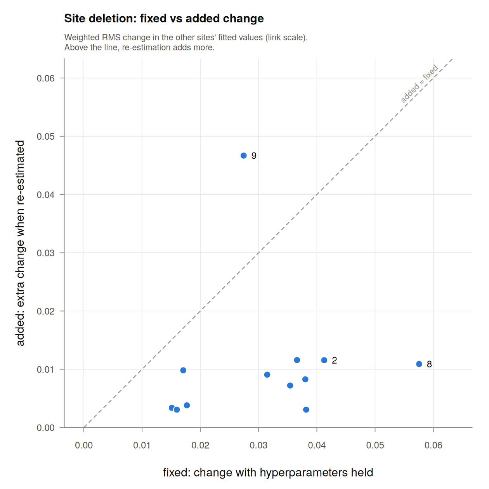

# gamfluence

[](https://github.com/FayeSong-0223/gamfluence/actions/workflows/R-CMD-check.yaml)

**Which sites change your GAM when you leave them out, and how much of that change comes from the smoothing parameters re-tuning?**

`gamfluence` answers this for penalised additive (mixed) models fitted with `mgcv::gam()`. mgcv itself has no deletion diagnostics: `influence.gam()` only returns leverages.

For each site (cluster), the model is refitted without it, twice:

- **fixed:** the estimated smoothing parameters (and negative binomial θ) are held at their full-data values. This is what a classical deletion diagnostic sees.
- **re-estimated:** they are re-estimated without the site.

Comparing the two shows influence that runs through the smoothing parameters. For a random-effect term, the smoothing parameter sets the estimated between-site variance, so a site with an extreme level can change how strongly *every other* site is shrunk. A fixed-parameter diagnostic cannot see that.

## Installation

```r
# install.packages("remotes")
remotes::install_github("FayeSong-0223/gamfluence")
```

## Example

```r
library(mgcv)
library(gamfluence)
set.seed(1)
d <- data.frame(site = factor(rep(1:12, each = 6)), x = runif(72))
d$y <- sin(2 * pi * d$x) + rnorm(12, 0, 0.4)[d$site] + rnorm(72, 0, 0.5)
m <- gam(y ~ s(x) + s(site, bs = "re"), data = d, method = "REML")

infl <- gam_influence(m, cluster = "site")
infl                          # largest changes, and which hyperparameters moved
top_units(infl, by = "added")
plot(infl, n = 3)             # fixed against added, one point per site
```



Sites above the dashed line change the fit more through the smoothing parameters re-tuning than through the held-parameter refit. Here site 9 stands out: re-estimating the smoothing parameters adds more than the held-parameter refit shows.

**`infl$sites`** has one row per site:

| column | meaning |
|---|---|
| `fixed` | change in the other sites' fitted values, smoothing parameters held |
| `added` | what re-estimating them adds |
| `total` | change when everything is re-estimated |
| `status`, `note` | `ok`, or what happened (rank deficiency, a held smoothing parameter, two REML optima, non-convergence) |

For every fitted value, fixed + added = total exactly. The table shows RMS summaries of those changes, and RMS values do not add. `total` is never larger than `fixed + added`, and equals it only when one change is a non-negative multiple of the other. A smaller `total` only means the two changes are not perfectly aligned. On its own it does not mean re-estimation offsets the fixed change; offsetting shows up as `total`² < `fixed`² + `added`².

**`infl$hyper`** gives each hyperparameter's full-data value, its value without the site, and their ratio. Random-effect terms are shown as standard deviations. A very large smoothing-parameter ratio means the smooth became close to a straight line; the exact number is then not meaningful.

**Two optima.** The REML score can have more than one optimum, often a curved fit and a nearly straight one. So the re-estimated refit is searched for twice, from mgcv's default starting values and from the full-data values, and the fit with the better REML score is used. When the two searches end at clearly different fits, `status` says `two optima` and `note` gives the other fit's `total` and how much worse its REML score was. A small difference means the data barely prefer one fit, so read that site's `added` and `total` with care.

**Units.** Changes are weighted RMS changes in the linear predictor. The weights are the fit's IRLS weights, so rows with more information count more.

On a log link, a change of d multiplies a prediction by exp(d): a relative change of exp(d) − 1. When the individual log changes are small, exp(d) − 1 ≈ d. So an RMS of 0.02 approximates a weighted RMS relative change of about 2% in the other sites' predicted means. The approximation fails for large individual changes (d = 0.2 is +22%, d = −0.2 is −18%), and a small RMS can still hide a few large changes.

There is no null reference, so compare sites with each other.

## Scope

**Supported:**

- `gam(..., method = "REML")` with the default optimizer;
- families:
  - gaussian (identity link);
  - poisson (log);
  - binomial (logit; 0/1, factor, proportions with weights, or `cbind`);
  - negative binomial via `nb()` or `negbin()` (log or sqrt link);
- one-dimensional `s()` with the default thin-plate basis, `s(g, bs = "re")` with `g` a factor, and `by = factor`;
- offsets, prior weights, user-fixed smoothing parameters;
- rows dropped by `na.action` or `subset`.

**Rejected with an error:**

- tensor, factor-smooth and multi-penalty terms;
- random effects with more than one variable, such as random slopes `s(g, x, bs = "re")`;
- other bases;
- other families and links;
- methods other than REML;
- non-default `gamma`, `scale`, `min.sp`, `H` or `paraPen`;
- `bam()` and `gamm()` fits.

Before any deletion the package also checks that it can reproduce your fit, and stops if it cannot.

All results are conditional on the full-data representation. The model matrix, constraints and penalties of your fit are reused for every refit rather than rebuilt from the reduced data.

## How it is checked

`tests/testthat` contains 412 expectations. They check that:

- the refits reproduce the original fit;
- the fixed refit reduces exactly to Cook's distance for a linear model, and to it in the limit as a held smoothing parameter goes to zero;
- deletions match a closed form (Gaussian, smoothing parameters held) and ordinary `gam()` refits (random-effect models);
- the re-estimated refits are optimal under an independently coded REML criterion (Gaussian, Poisson, binomial);
- the package handles row alignment, rank deficiency after deletion, two REML optima, and out-of-scope models correctly.

Two scripts in `validation/` print the numbers behind these checks. `planted_site.R` is a small known-truth simulation:

- One site with an extreme random effect was planted in each of 20 datasets.
- **fixed** never exceeded its null 99% line (0 of 20 datasets).
- **added** exceeded its null 99% line in 20 of 20.

Leaving the site out would also show up in the total change (18 of 20). What the package adds is *where* the influence comes from, not whether a site is influential.

## Limitations

- For negative binomial models with covariate smooths, the re-estimated refit is checked for reproduction and convergence only. The independent reference covers random-effect-only negative binomial models.
- Two searches find the better of two REML optima, not necessarily the best overall.
- The planted-site check is one Gaussian design with one effect size.
- No null reference or p-values.
